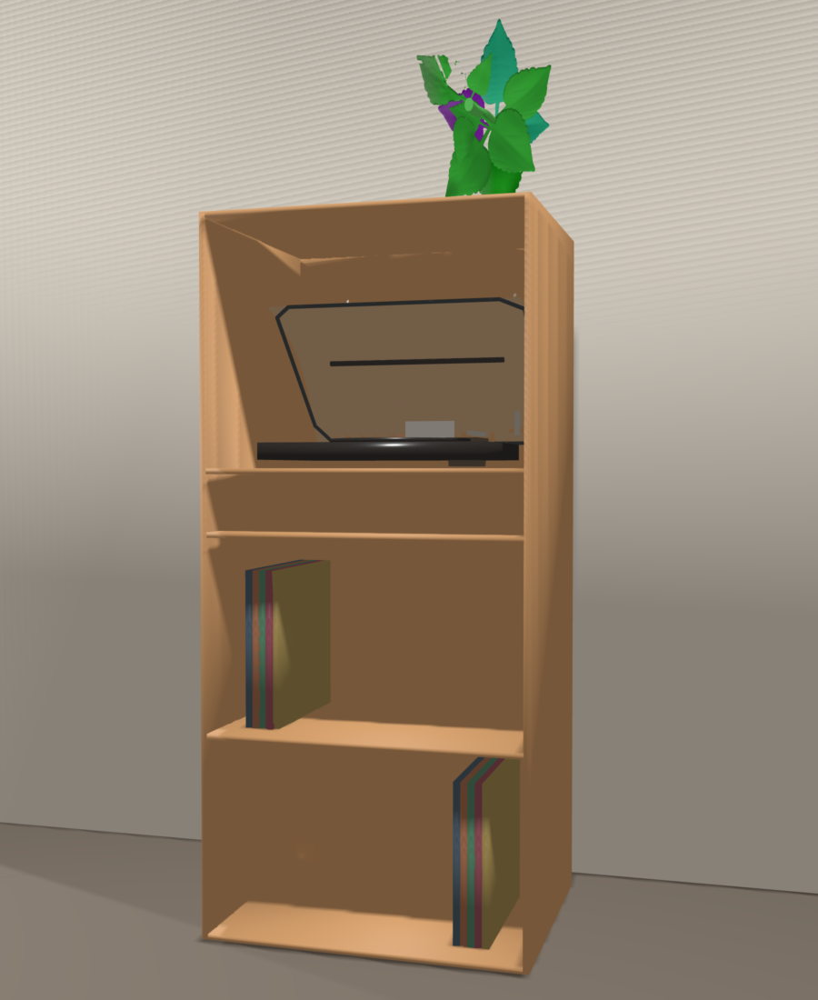

# Spårvik

Spårvik is a compact Scandinavian-style vinyl and turntable cabinet generated with
`build123d`.

## The name

**Spårvik** is a Swedish-inspired name:

- **spår** means “track” or “groove”, referring to a vinyl record groove.
- **vik** means “bay” or “cove”, referring to the recessed storage spaces.

Together, *Spårvik* suggests “groove bay”: a small, calm storage place for music.
It is a designed product name rather than a claim that *Spårvik* is a traditional
Swedish furniture term.

## Rendering



The PNG is rendered by `render_sparvik.py` with `trimesh` and `pyrender2`.
The cabinet itself is loaded from `exports/sparvik_assembly.stl`, so the render
uses the actual exported build123d geometry. Materials, lighting, shadows, a
detailed turntable placeholder, and simple vertical 3D records are added in the
render scene. The downloaded CC0 assets are:

- `assets/cc0_speaker.glb` as an audio accessory
- `assets/potted_coleus.glb`, converted from the supplied `.3DS` file with Assimp
- Simple record geometry: five thin records in box 1 on the left and five in box 2 on the right

The records use 225 mm height, 205 mm depth, and 12 mm thickness per record.
The supplied Free3D Coleus model was converted from `.3DS` to `.glb` with the
Assimp command-line converter and is now used by the renderer. The original files
remain in `assets/coleus/`. Replace the turntable placeholder with a licensed
real-world turntable model if preferred.

## Layout

From top to bottom:

1. Turntable allocation space
2. 100 mm clear spacing layer
3. Full-width spacing plane
4. Disc box 1
5. Disc box 2
6. Full closed back panel

The two disc boxes share one 10 mm shelf. The bottom panel is the lower boundary
of disc box 2; there are no duplicate panels at either record-box boundary.

## Material cut list, grouped for long panels

All frame panels use the same nominal **10 mm** board thickness. The list below is
grouped by board-strip width so long material can be bought and cut efficiently.
Dimensions are written as **cut length × cut width × thickness**.

### 440 mm-wide material

Buy at least **5170 mm of 440 mm-wide, 10 mm-thick board** before allowing for
saw kerf and trimming. A practical allowance is approximately 5–10% extra.

| Quantity | Cut length | Part |
|---:|---:|---|
| 2 | 1260 mm | Side panels |
| 5 | 530 mm | Top, bottom, record middle, spacing, and turntable shelves |

Total net cut length: **2 × 1260 + 5 × 530 = 5170 mm**.

### 530 mm-wide material

Buy at least **1240 mm of 530 mm-wide, 10 mm-thick board**, plus saw kerf and
trimming allowance.

| Quantity | Cut length | Part |
|---:|---:|---|
| 1 | 1240 mm | Full back panel |

### Cutting notes

- The five 530 × 440 mm shelves can be cut from the 440 mm-wide material.
- The full back is 530 × 1240 mm and therefore uses a separate 530 mm-wide strip.
- If buying standard full sheets rather than long strips, use the same grouped
  dimensions as the cutting plan.
- Keep all finished parts at **10 mm thickness**; do not substitute thicker panels
  for individual frame pieces unless the layout is recalculated.

### Additional supplies

- Wood screws or confirmat screws suitable for 10 mm plywood/furniture board.
- Suitable wall anchors and screws for the wall construction.
- Edge banding for exposed plywood edges, if required.
- Wood glue, if using glued joints in addition to mechanical fasteners.
- Finish, paint, veneer, or clear coat for the desired light-wood appearance.
- Optional felt or rubber pads below the cabinet and turntable.

The back panel includes one approximately **100 × 50 mm** cable opening and two
**8 mm diameter** wall-anchor holes. Anchor the cabinet to suitable wall studs or
masonry, especially when it is loaded with records. The 10 mm material choice is
not structurally certified; verify the board, fasteners, spans, and wall fixing
before construction.

## Dimensions and clearances

- Overall cabinet: **550 × 440 × 1260 mm**
- Turntable assumed size: **450 × 400 × 360 mm**
- Turntable allocation: **500 × 420 × 385 mm**
- Record size assumed: **320 × 320 mm**
- Each record box: **340 × 350 × 340 mm**
- Clear spacing between the record section and turntable: **100 mm**

## Generate the CAD files

From the project root:

```bash
uv run python sparvik/sparvik.py
```

## Generate the rendering

From the project root:

```bash
uv run python sparvik/render_sparvik.py
```

This overwrites `sparvik/sparvik_render.png`. The render script is intentionally
separate from the CAD generator so lighting, camera, materials, plant geometry,
and display objects can be changed without affecting the STEP/STL exports.

The script validates the solids and writes:

```text
sparvik/exports/sparvik_assembly.step
sparvik/exports/sparvik_assembly.stl
sparvik/exports/components/*.step
```
